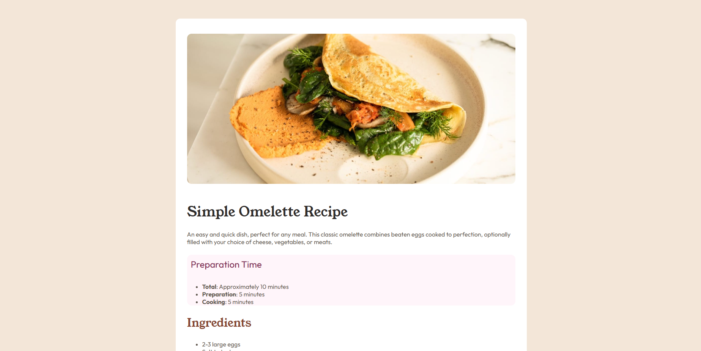
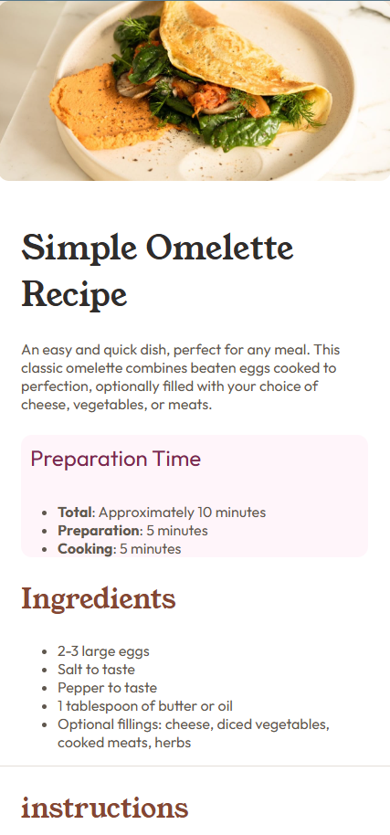

# Frontend Mentor - Recipe page solution

This is a solution to the [Recipe page challenge on Frontend Mentor](https://www.frontendmentor.io/challenges/recipe-page-KiTsR8QQKm).

## Overview

### Screenshot

### Links

- Solution URL: [GitHub](https://github.com/JoelJohs/frontend-mentor_recipe-page-main)
- Live Site URL: [Add live site URL here](https://your-live-site-url.com)

## My process

### Built with

- Semantic HTML5 markup
- CSS custom properties
- Flexbox
- CSS Grid

## Author

- freeCodeCamp - [@JoelJohs](https://www.freecodecamp.org/JoelJohs)
- Frontend Mentor - [@JoelJohs](https://www.frontendmentor.io/profile/JoelJohs)
- GitHub - [JoelJohs](https://github.com/JoelJohs)
